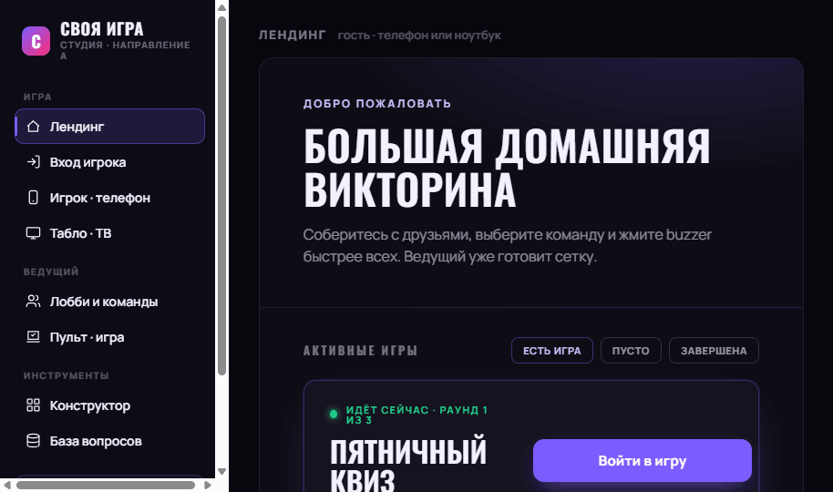
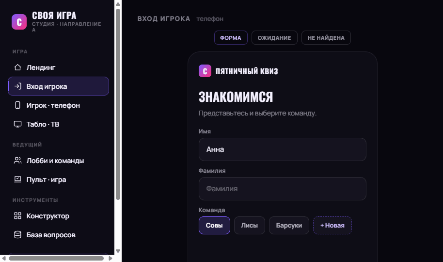
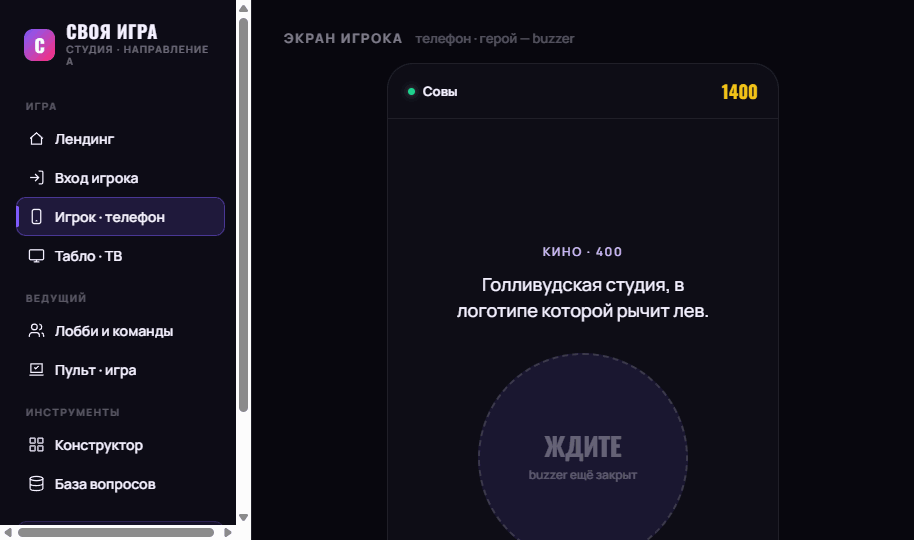
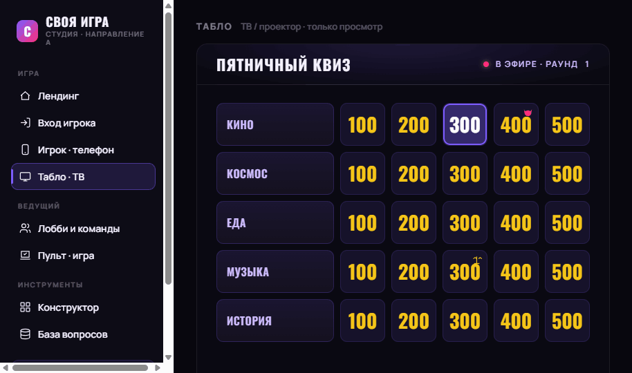
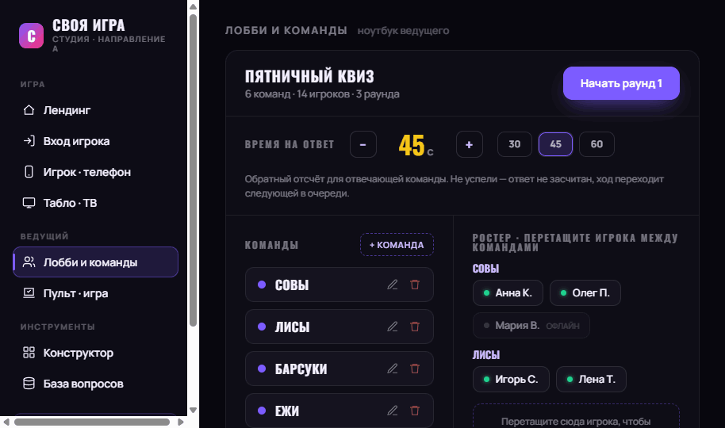
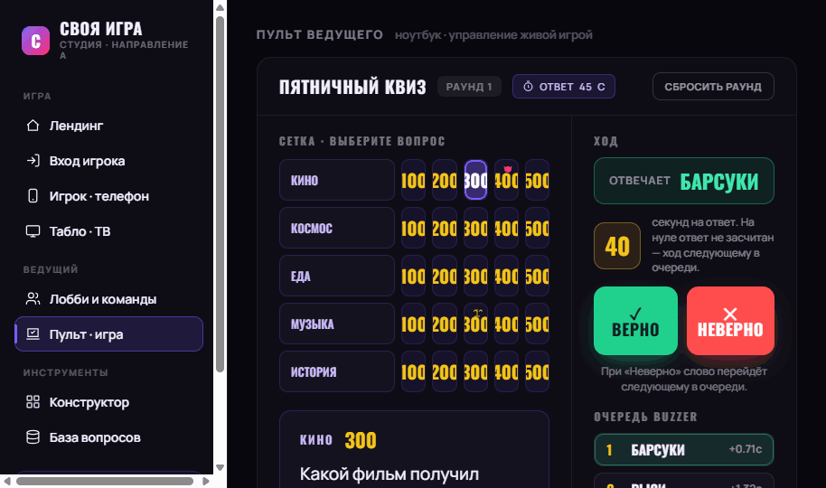
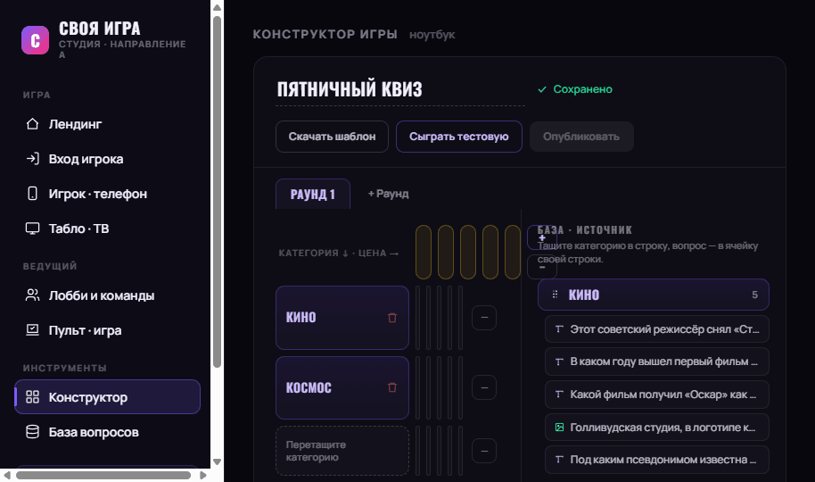
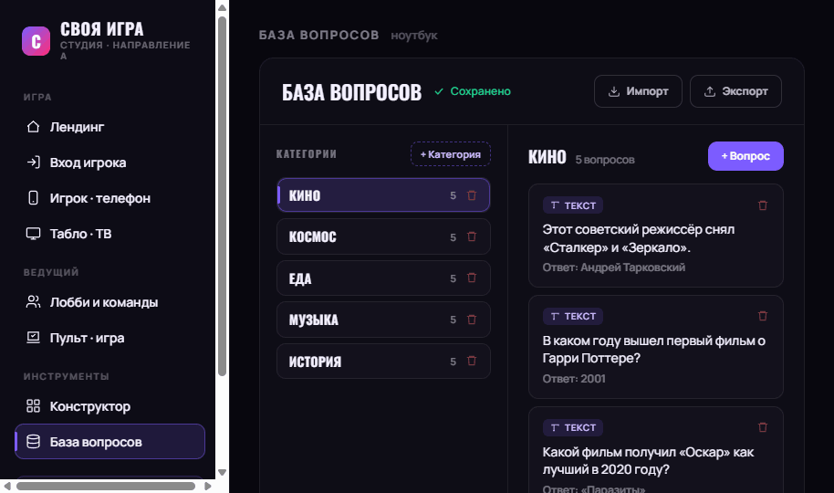

# Хендофф: «Своя игра» — домашняя командная викторина

> Спецификация для разработчика. Документ самодостаточен: по нему можно реализовать
> продукт, не видя исходной переписки. Текст интерфейса — русский, на «вы», дружелюбный,
> без канцелярита; кнопки — активным глаголом.

---

## 1. Обзор

«Своя игра» — домашняя командная игра-викторина (по духу близко к Jeopardy!). Работает в
локальной сети: один компьютер-сервер, остальные подключаются с телефонов и большого
экрана. Команды отвечают на вопросы из сетки категорий разной стоимости; кто быстрее нажал
buzzer — отвечает; ведущий судит и ведёт счёт.

Платформа раскрывается в **трёх очень разных контекстах**, объединённых одним визуальным
языком («Студия» — тёмный кинематографичный):

| Роль | Устройство | Суть |
|---|---|---|
| **Игрок** | телефон | герой-кнопка buzzer; реакция критична по времени |
| **Табло** | большой экран / ТВ | только просмотр; драматично, читаемо с 2–5 м |
| **Ведущий** | ноутбук | плотный пульт управления живой игрой |
| **Гость** | телефон/ноутбук | лендинг: увидеть активную игру, войти |
| **Админ** | ноутбук | конструктор игры + база вопросов (вдумчивая работа заранее) |

---

## 2. О файлах в пакете

Файлы `*.dc.html` — это **дизайн-референсы, сделанные в HTML**: рабочие прототипы,
показывающие задуманный вид и поведение. **Это не продакшн-код для копирования.**

Задача — **воссоздать эти экраны в среде вашего кодовой базы** (React/Vue/SwiftUI/нативно
и т.п.), используя её устоявшиеся паттерны, компоненты и библиотеки. Если среды ещё нет —
выбрать подходящий стек (для LAN-игры реального времени логичны React + WebSocket-сервер,
состояние комнаты на сервере, синхронизация по сокетам) и реализовать дизайн там.

Прототип написан как «Design Component» (один HTML-файл со встроенным рантаймом
`support.js`). **Не тащите этот рантайм в продакшн** — он только для просмотра прототипа.
Откройте `.dc.html` в браузере, чтобы вживую пощёлкать все экраны и состояния.

> Технические замечания по прототипу (не воспроизводить буквально): команды-соперники
> «нажимают» buzzer автоматически на таймерах, чтобы наполнить очередь для демонстрации;
> в реальном продукте нажатия приходят с телефонов по сети. Состояние игры в прототипе
> хранится в одном клиенте — в продукте оно должно жить на сервере и рассылаться всем
> устройствам комнаты.

---

## 3. Точность (fidelity)

**High-fidelity.** Цвета, типографика, отступы, радиусы и взаимодействия — финальные.
Воспроизводите UI пиксель-в-пиксель средствами вашей кодовой базы. Раздел «Дизайн-токены»
(§8) содержит точные значения.

Визуальный язык **намеренно НЕ привязан** к корпоративному дизайн-системе ANT/RPA — это
отдельный «праздничный шоу»-стиль под домашнюю викторину. Используйте токены из §8.

---

## 4. Сигнатурные элементы (на них держится узнаваемость)

1. **Сетка цен** (категории × стоимости) — центральный мотив, и в игре (табло/пульт), и в
   редакторе (конструктор). Отыгранная ячейка «гаснет» (тёмная заливка + галочка).
2. **Buzzer** — кнопка-герой на телефоне игрока. Тактильность, мгновенность, явные
   состояния.
3. **Табло счёта** — командный счёт как на ТВ-шоу: лидер выделен золотом, отрицательные
   значения читаемы красным.
4. **Очередь buzzer** («змейка») — порядок нажавших с дельтами времени.
5. **Иконки мини-игр** — «Кот в мешке» (морда кота) и «Аукцион» (весы).
6. **Драма открытия вопроса** — вопрос раскрывается оверлеем во весь экран табло.

---

## 5. Экраны

Навигатор прототипа сгруппирован: **Игра** (Лендинг, Вход игрока, Игрок, Табло),
**Ведущий** (Лобби, Пульт), **Инструменты** (Конструктор, База вопросов).

### 5.1. Лендинг — `/` (гость, телефон/ноутбук)
- **Назначение:** показать активную игру и дать войти.
- **Макет:** карточка-герой (radial-glow в шапке) + секция «Активные игры».
- **Состояния (3):**
  - *Есть игра* — карточка: статус «Идёт сейчас · раунд N из M» (зелёная точка-glow),
    название, метрики (команд из макс., игроков, раундов), кнопки **Войти в игру**
    (primary `#7c5cff`) и **Открыть табло** (outline).
  - *Пусто* — пунктирная карточка-приглашение «Пока ни одной игры» (не ошибка).
  - *Завершена* — приглушённая карточка (opacity .62) с победителем, тег «Архив».

### 5.2. Вход игрока — `/play?game=…` (телефон)
- **Назначение:** быстро представиться и попасть в команду.
- **Макет:** телефонный фрейм 392px, скругл" 26px.
- **Состояния (3):**
  - *Форма* — поля **Имя**, **Фамилия** (высота 48px, radius 12px), выбор команды чипами
    (активная — фиолетовая обводка) + чип «+ Новая» (пунктир). Кнопка **Войти в команду**.
  - *Ожидание* — спиннер, «Ждём ведущего», индикатор «На связи» (зелёная точка).
  - *Игра не найдена* — красная иконка-кружок, пояснение, кнопка «К списку игр».

### 5.3. Экран игрока — `/play` (телефон, ГЕРОЙ)
Телефонный фрейм 392px. Шапка: имя команды + точка связи + счёт (золото). Низ:
переключатель «Вы за: …» (в прототипе — для демонстрации перспективы). **Состояния
(определяются фазой игры + локальным фолстартом):**
- **Выбирайте вопрос** — крупно (Oswald 38px), когда очередь выбора у вашей команды.
- **Выбор вопроса** — спиннер + «Выбирает команда „…“».
- **Готовность (prep)** — текст вопроса + дашед-кнопка «ЖДИТЕ · buzzer ещё закрыт».
  Нажатие сейчас = фальстарт.
- **Buzzer открыт** — большой круг `ЖМУ` (240px), magenta-radial-gradient, анимация
  `pulseRing`. Нажатие ставит вас в очередь.
- **ВЫ ОТВЕЧАЕТЕ!** — зелёный круг (240px) + обратный отсчёт ответа (крупные цифры).
- **Отвечает <Команда>** — приглушённо; если вы в очереди — «Вы в очереди · #N»; идёт
  отсчёт.
- **Верно! / Никто не ответил** — итог с галочкой.
- **Фальстарт** — см. §6.5: кнопка краснеет, кулдаун идёт сектором по ободу круга, под
  кнопкой «Фальстарт!».

### 5.4. Табло — `/board?game=…` (ТВ/проектор, только просмотр)
Фрейм 1040px, 16:9. Шапка: название + «В эфире · раунд N» (magenta-glow точка). Контент —
**сетка раунда** (категории слева, цены в ячейках золотом). Подвал — **строка счёта**:
все команды (демо — 6), лидер в золотой подсветке, отрицательный счёт красным.
- **Оверлей вопроса** (`hasCur`): категория + цена + (тег мини-игры), крупный текст
  вопроса (Oswald 38px), справа — **очередь buzzer** (номер, команда, `+0.71с`). Внизу
  баннер «Отвечает <Команда>» + **крупный обратный отсчёт** (золото; ≤10с — красный,
  крупнее). Итог: «Верно! <Команда> +<цена>» (зелёный) или «Никто не ответил · ответ: …».
- **Сцены табло (доп.):** «Итоги раунда» (рейтинг команд), «Победитель» (кубок, имя 72px,
  очки). Переключаются кнопками под фреймом (в продукте — командами ведущего).

### 5.5. Лобби — `/host` до старта (ноутбук)
Шапка: название + «6 команд · 14 игроков · 3 раунда» + **Начать раунд 1** (primary).
- **Настройка:** «Время на ответ» — степпер ±5 и пресеты **30 / 45 / 60** с (активный —
  фиолетовая подсветка). Пояснение про обратный отсчёт.
- **Команды:** список с цветной точкой, имя, иконки переименовать/удалить, «+ Команда».
- **Ростер:** игроки по командам, индикатор онлайн (зелёная точка) / офлайн (тускло,
  тег «офлайн»). Зона «Перетащите сюда игрока…» (перевод между командами, drag&drop).

### 5.6. Пульт ведущего — `/host` в игре (ноутбук)
Двухколоночный плотный экран. Шапка: название + «Раунд N» + чип **«Ответ 45 с»** +
**Сбросить раунд**.
- **Левая колонка:** **сетка** для выбора вопроса (кликабельна только в фазе выбора;
  отыгранные — гаснут; выбранная — фиолетовая обводка). Ниже — карточка текущего вопроса:
  категория+цена, текст, **ответ (только ведущему)** в золотой пунктирной плашке; для
  мини-игр — контролы (Кот: чипы команд-получателей; Аукцион: ставки команд).
- **Правая колонка (рейл «Ход»):** действие по фазе:
  - *Выбор* — подсказка «Выбирает команда „…“».
  - *Вопрос* — большая кнопка **Открыть buzzer** (primary).
  - *Buzzing* — спиннер «Buzzer открыт · ждём нажатий».
  - *Answering* — баннер «Отвечает <Команда>» + **обратный отсчёт** (≤10с красный) +
    две большие однозначные кнопки **✓ Верно** (зелёная) / **✕ Неверно** (красная).
  - *Judged* — итог + **Следующий вопрос**.
  - **Очередь buzzer** (номер/команда/дельта).
  - **Счёт · правка ±100** — строка на команду: имя, счёт (золото), кнопки − / +
    (отвечающая команда подсвечена).

### 5.7. Конструктор игры — `/admin` (ноутбук, drag&drop — самый сложный)
Шапка: редактируемое **название игры** (инлайн-инпут) + индикатор автосохранения +
кнопки **Скачать шаблон**, **Сыграть тестовую**, **Опубликовать**. Вкладки раундов.
- **Сетка:** строка заголовков с **редактируемыми ценами** (золотые числовые инпуты);
  справа колонка кнопок **+ / −** столбец. Строки = категории; снизу **+ Строка**, у
  каждой строки — кнопка удаления.
- **Левая ячейка строки** — зона приёма категории: если пусто — пунктир «Перетащите
  категорию»; если привязано — название категории + удалить.
- **Сайдбар «База · источник»:** дерево категорий базы; каждая категория — draggable
  карточка (grip-иконка), под ней — её вопросы (draggable чипы с иконкой типа).
- **Drag&drop правила:**
  1. Перетащить **категорию** на строку → строка привязывается к категории.
  2. Перетащить **вопрос** в ячейку — **только в строку своей категории**. В свою —
     зелёная рамка-подсветка; в чужую — **красная рамка с иконкой запрета**, бросок
     отклоняется.
  3. В заполненной ячейке — переключатель **тега мини-игры** по клику: `Тег → Кот →
     Аукцион → …`; крестик очищает ячейку.
- **Лайв-валидация:** «Опубликовать» неактивна, пока есть незаполненные строки/ячейки;
  плашка «Что мешает опубликовать»: «Строк без категории: N · Пустых ячеек: M». Когда всё
  заполнено — зелёное «Всё заполнено — можно публиковать».
- **Модалка публикации:** «Новый пак» / «Перезаписать текущую» + «Отмена».

### 5.8. База вопросов — `/admin` (ноутбук, продуктивный инструмент)
Шапка: «База вопросов» + автосохранение + **Импорт** / **Экспорт**.
- **Слева — категории:** список (имя, счётчик, удалить; активная подсвечена),
  «+ Категория».
- **Справа — вопросы выбранной категории:** заголовок (имя + «N вопросов») + **+ Вопрос**.
  Карточки: чип типа (**Текст** фиолетовый / **Картинка** зелёный / **Аудио** золотой),
  текст вопроса, «Ответ: …», удалить.
- **Редактор вопроса** (открывается справа от списка): переключатель типа (сегменты), для
  *картинки* — зона загрузки с превью (пунктир), для *аудио* — мок-плеер (play +
  «волна» + длительность), **Текст вопроса** (textarea), **Ответ (видит только ведущий)**
  (инпут, золотой текст). **Кнопки «сохранить» нет — автосохранение** (индикатор
  «Сохранение… → Сохранено ✓»). Здесь **нет** цены и мини-игр (чистый контент).

---

## 6. Взаимодействия и поведение

### 6.1. Основной игровой цикл (фазы)
`select → question → buzzing → answering → judged → (next) → select`
- **select:** ведущий выбирает ячейку в сетке (только не отыгранную). Право выбора —
  у команды `chooser` (по умолчанию — лидер/последняя ответившая верно).
- **question:** показан вопрос; buzzer ещё закрыт. Нажатие игроком → **фальстарт**.
- **buzzing:** ведущий нажал «Открыть buzzer». Игроки жмут; первое нажатие → `answering`.
- **answering:** отвечает первый в очереди; запущен **таймер ответа**. Ведущий судит.
- **judged:** показан итог; «Следующий вопрос» помечает ячейку отыгранной и → `select`.

### 6.2. Очередь buzzer
Каждое нажатие фиксирует дельту времени `dt` (с момента открытия buzzer), очередь
сортируется по `dt`. Первый — отвечает; остальные ждут. Отображается на табло и пульте
(номер, команда, `+Xс`), отвечающий подсвечен зелёным.

### 6.3. Судейство
- **Верно:** `+цена` отвечающей команде; фаза `judged` (result=correct); право выбора
  переходит этой команде. Затем «Следующий вопрос».
- **Неверно:** `−цена` команде; она удаляется из очереди; если в очереди есть следующий —
  он становится отвечающим (фаза снова `answering`, таймер перезапускается); если очередь
  пуста — `judged` (result=wrong), показывается правильный ответ.
- Ручная правка очков: ±100 на команду (в продукте — и произвольная дельта).

### 6.4. Таймер ответа (обратный отсчёт)
- Длительность задаёт ведущий в лобби: **30–60 с** (пресеты 30/45/60, шаг ±5).
- Стартует, когда команда **начинает отвечать** (вход в `answering`); виден на телефоне
  игрока, на табло (крупно у имени), на пульте (рядом с Верно/Неверно).
- Цвет: золото; при **≤10 с** — красный и крупнее.
- **На нуле:** ответ автоматически НЕ засчитывается → эквивалент «Неверно» для этой
  команды (`−цена`), ход переходит **следующему в очереди**; для каждой следующей команды
  отсчёт стартует заново. Если очередь исчерпана — открывается правильный ответ.

### 6.5. Фальстарт (важная деталь — НЕ открывать новый круг)
Если игрок нажал buzzer **до** открытия (фаза `question`):
- кнопка buzzer **краснеет** (red-radial-gradient `#ff6b6b → #ff2d2d → #c81e2e`);
- кулдаун идёт **обратным отсчётом по ободу** круга (SVG-кольцо, `stroke-dashoffset`
  с переходом `1s linear`, длительность блокировки ~3 с; в центре — крупная цифра
  оставшихся секунд);
- текст под кнопкой меняется на **«Фальстарт!»**;
- по истечении — кнопка возвращается в исходное состояние (новый круг/раунд НЕ
  запускается).

### 6.6. Анимации
- `popIn` (0.2–0.25s ease) — появление оверлеев, итогов, состояний игрока.
- `pulseRing` (1.4s, бесконечно) — пульсация активного buzzer (`ЖМУ`).
- `spin` (0.8–1.1s) — спиннеры ожидания/сохранения.
- Таймер-кольцо фальстарта — `transition: stroke-dashoffset 1s linear`.
- Кнопки: `:active` — лёгкое `translateY(2–6px)/scale(.96)`.
- **`prefers-reduced-motion: reduce` → все анимации отключаются** (обязательно).

### 6.7. Доступность
- Видимый фокус с клавиатуры (focus-ring на кликабельных), `tabindex` на кастомных
  кнопках. На телефоне цель нажатия крупная (buzzer 210–240px).
- Высокий контраст (тёмное окружение, приглушённый свет в комнате).

### 6.8. Пустые состояния и ошибки (тон — приглашение, не тупик)
Нет активных игр; пустая база; новая игра без вопросов; неверный пароль админа;
невалидная игра при публикации; недопустимое имя команды; бросок вопроса в чужой ряд
(красная рамка-запрет). Сообщения объясняют, что не так и что сделать.

### 6.9. Связь/реконнект (заложить в продукте)
Индикаторы онлайн/офлайн у игроков и команд (зелёная точка / тусклый тег «офлайн»);
состояния «подключение к игре», «ждём ведущего». LAN-синхронизация состояния комнаты.

---

## 7. Модель состояния (ориентир для сервера/стора)

```
game = {
  round,                         // номер раунда
  teams: [{ id, name, score }],  // счёт может быть отрицательным
  played: { "<row>-<col>": true },
  phase: 'select'|'question'|'buzzing'|'answering'|'judged',
  cur: { row, col, value, question, answer, category, mini },  // mini: null|'cat'|'auction'
  queue: [{ teamId, dt }],       // отсортирована по dt
  answering: teamId|null,
  result: 'correct'|'wrong'|null,
  chooser: teamId,               // чья очередь выбирать
  answerTime: 30..60,            // секунд на ответ (настройка ведущего)
  timeLeft,                      // текущий обратный отсчёт
}
// локально у игрока:
falseStartLock                   // секунды блокировки фальстарта (≈3 → 0)

// контент (админ):
base = { categories: [{ id, name, questions: [{ id, type:'text'|'image'|'audio', q, a }] }] }
// сборка игры (конструктор):
builder = {
  name, rounds: [{ cols: [price,…], rows: [{ catId|null, cells: [ { qId, mini }|null, … ] }] }]
}
```
Переходы — см. §6.1–6.5. Ключевая инварианта: вопрос и **ответ** видит только ведущий;
на табло/у игрока ответ не показывается (кроме момента раскрытия правильного ответа).

---

## 8. Дизайн-токены (точные значения)

### Цвета
| Назначение | HEX / значение |
|---|---|
| Фон приложения | `#08070e` |
| Панель / карточка | `#0e0d16` |
| Поднятая поверхность | `#15131f`, `#13111c` |
| Ячейка сетки | `#16122a` (hover `#211a3d`) |
| Заливка строки-метки | gradient `#1a1530 → #15111f` |
| Бордеры | `rgba(255,255,255,.07)` / `.08`; фиолет `rgba(124,92,255,.16–.30)` |
| Текст основной | `#f4f1ff` |
| Текст вторичный / третичный | `rgba(244,241,255,.55)` / `.45` / `.30` |
| Текст-акцент (фиолет.) | `#cdbcff` |
| **Акцент (primary)** | `#7c5cff` (hover `#8b6bff`) |
| **Buzzer / magenta** | `#ff2d78` (gradient `#ff5a93 → #ff2d78 → #d10f54`) |
| **Золото** (цены, лидер, ответ, таймер) | `#f5c518` |
| **Успех / «отвечаете» / верно** | `#1fd18e`, светлый `#43e9b0` |
| **Ошибка / минус / неверно** | `#ff4d4d`, `#ff6b6b` |
| Фальстарт-круг | gradient `#ff6b6b → #ff2d2d → #c81e2e` |
| Кот в мешке (иконка) | `#ff2d78` · Аукцион (иконка) | `#f5c518` |

### Типографика
- **Дисплейная — `Oswald`** (400/500/600/700), часто `text-transform:uppercase`,
  `letter-spacing` .02–.06em. Шоу-моменты: заголовки, цены, имена команд, крупные цифры,
  текст вопроса.
- **Интерфейсная — `Manrope`** (400/500/600/700/800). Body, лейблы, кнопки, описания.
- Кириллица обязательна (обе гарнитуры поддерживают). Google Fonts:
  `Oswald:wght@400;500;600;700` + `Manrope:wght@400;500;600;700;800`.
- Размеры-ориентиры: цены в сетке 20–30px (Oswald 700); текст вопроса 38–40px (Oswald 600);
  `ЖМУ` 64px; `ВЫ ОТВЕЧАЕТЕ` 40px; обратный отсчёт 52–86px; победитель 72px; счёт 22–26px;
  body 13–16px (Manrope); мелкие лейблы 10–12px uppercase.

### Радиусы
Ячейки/кнопки/инпуты **9–13px**; карточки/панели/модалки **16px**; пилюли/чипы **999px**;
buzzer **50%**.

### Отступы
Шаг 4px. Используемые: 6, 7, 8, 10, 12, 14, 16, 18, 20, 22, 24, 28, 32px.
Паддинг карточек 18–26px; шапки 16–20px; навигатор 252px ширина.

### Тени / свечения
- Карточка/фрейм: `0 24px 60px -20px rgba(0,0,0,.5)`, табло `0 30px 70px -30px rgba(0,0,0,.7)`.
- Свечение buzzer: `0 0 0 10px rgba(<accent>,.16), 0 18px 50px -8px rgba(<accent>,.7)`.
- Focus-ring инпутов: `0 0 0 3px rgba(124,92,255,.2)` + бордер `#7c5cff`.

### Движение
`popIn .2–.25s`, `pulseRing 1.4s`, `spin .8–1.1s`, таймер-кольцо `stroke-dashoffset 1s linear`,
кнопки `:active translateY/scale`. Уважать `prefers-reduced-motion`.

---

## 9. Ассеты и иконки
- **Иконки** — инлайн-SVG (outline/filled, stroke-width ~1.8–2), нарисованы под прототип:
  дом, вход, телефон, ТВ, команды, пульт, сетка (конструктор), БД (база), глаз, корзина,
  карандаш, кот (морда), весы (аукцион), кубок, лампочка, галочка, крест, стрелки
  импорт/экспорт, grip-точки, тег. В продукте берите эквиваленты из вашей icon-библиотеки
  (например, Phosphor) с тем же весом.
- **Картинки/аудио** в базе — пользовательский контент (загрузка с превью); в прототипе
  показаны плейсхолдерами.
- Эмодзи в UI **не используются**.
- Фирменных изображений нет — мини-логотип «С» в скруглённом квадрате с
  фиолет→magenta-градиентом (плейсхолдер; замените на реальный логотип).

---

## 10. Файлы в пакете
- **`Своя игра - Студия.dc.html`** — основной прототип «Студия»: навигатор по устройствам и
  все экраны со состояниями + живой игровой цикл (buzzer, очередь, судейство, таймер,
  фальстарт), конструктор с drag&drop и валидацией, база вопросов с автосохранением.
- **`Своя игра - направления.dc.html`** — ранняя витрина двух визуальных направлений
  (выбрана «Студия»; «Карнавал» — светлый альтернативный вариант для справки).
- **`support.js`** — рантайм прототипа (только для просмотра, **не для продакшна**).

Откройте `.dc.html` в браузере и пройдите по навигатору слева, чтобы увидеть все экраны и
состояния вживую.

---

## 11. Скриншоты (папка `screenshots/`)

Статичные снимки ключевых экранов — для быстрого обзора. **Источник истины — живой
прототип** (`.dc.html`): часть состояний (герой-buzzer `ЖМУ`/`ВЫ ОТВЕЧАЕТЕ`, фальстарт-
кольцо, полноэкранный оверлей вопроса на табло) использует радиальные градиенты, SVG-
кольца и анимации, которые не попадают в статичный снимок — смотрите их в браузере.

| Файл | Экран |
|---|---|
| `01-landing.png` | Лендинг — активная игра |
| `02-entry.png` | Вход игрока — форма |
| `03-player.png` | Экран игрока (телефон) — вопрос + buzzer (закрыт, «ЖДИТЕ») |
| `04-board.png` | Табло (ТВ) — сетка раунда (сигнатурный мотив) |
| `05-lobby.png` | Лобби — команды, ростер, настройка времени ответа |
| `06-host-answering.png` | Пульт ведущего — судейство: «Ответ», таймер, Верно/Неверно, очередь buzzer |
| `07-builder.png` | Конструктор игры — сетка, цены, drag&drop, база-источник |
| `08-base.png` | База вопросов — категории, карточки, типы |









